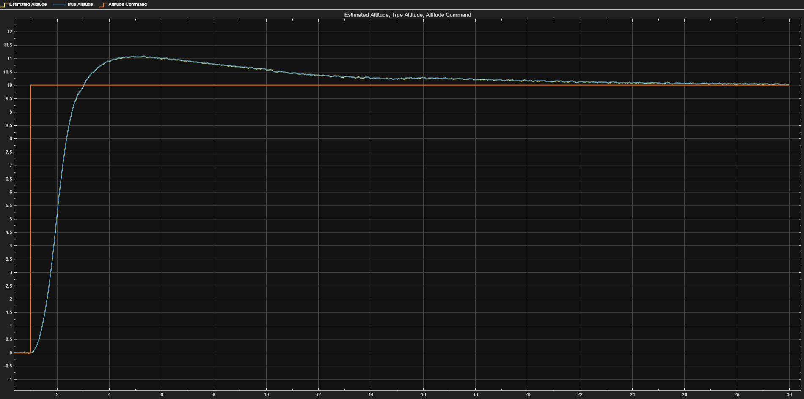
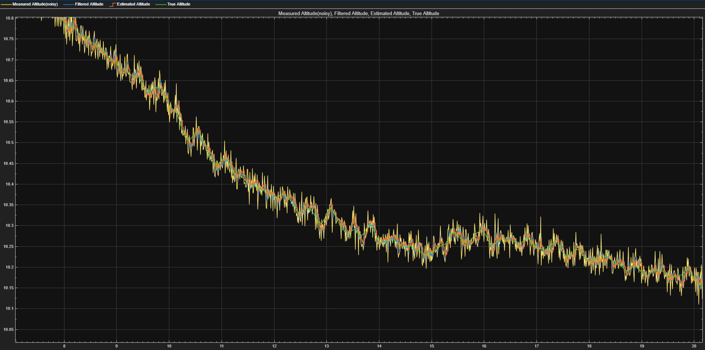
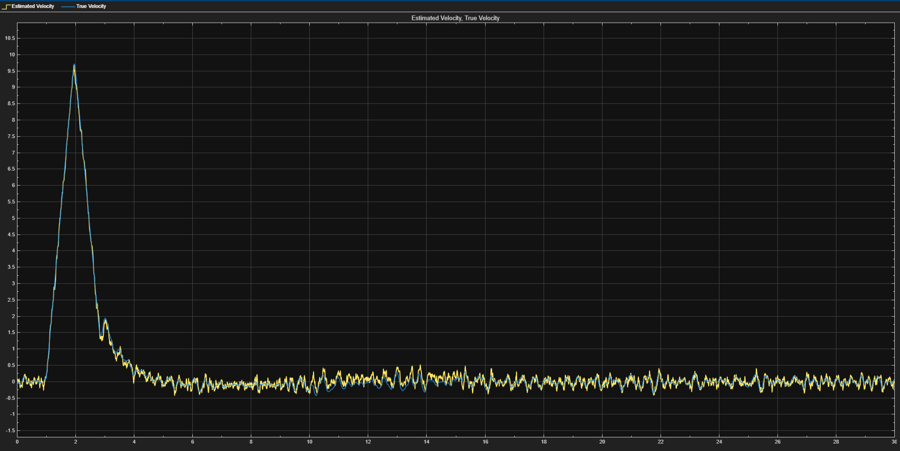
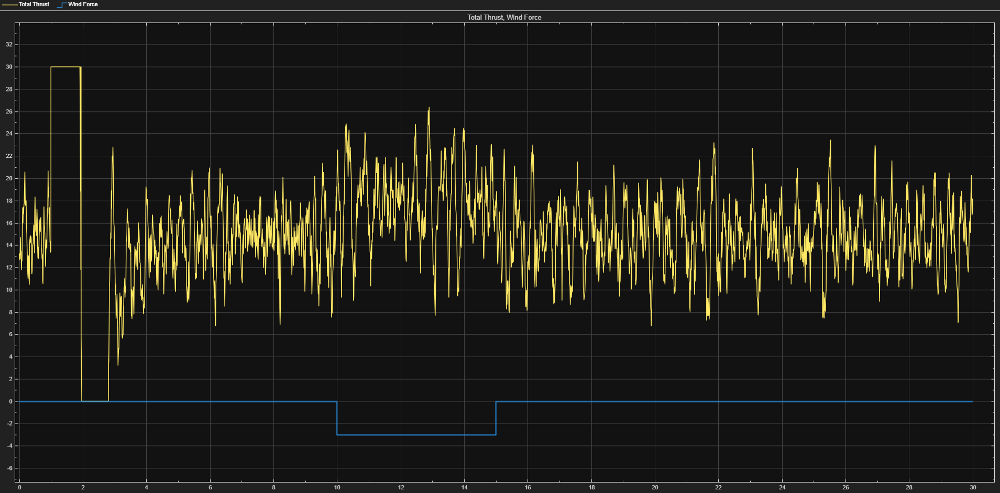

[README.md](https://github.com/user-attachments/files/33188024/README.md)[Uploading README.md…]# UAV Altitude Control and State Estimation

**MATLAB/Simulink | PID Control | Kalman Filtering | State-Space Modeling | UAV Dynamics**

A closed-loop altitude control simulation for a simplified unmanned aerial vehicle (UAV), developed in MATLAB and Simulink. The project combines PID feedback control, actuator saturation, sensor noise filtering, wind disturbance rejection, and Kalman-based state estimation.

The objective is to maintain a commanded altitude while estimating the vehicle's vertical position and velocity under measurement noise and actuator constraints.

## Simulation Results

### Altitude Tracking

The UAV follows a 10 m altitude command, reaching approximately 11.1 m at peak overshoot before gradually converging toward the target.

### Sensor Filtering and State Estimation

A simulated altitude sensor introduces measurement noise with a standard deviation of 0.02 m at 100 Hz. A low-pass filter smooths the feedback signal, while a discrete Kalman filter estimates altitude and vertical velocity.

### Wind Disturbance Rejection

A downward disturbance of 3 N is applied from 10 to 15 seconds. The controller increases thrust to compensate and returns toward nominal hover thrust after the disturbance ends.

## System Architecture

The simulation consists of four primary subsystems:

1. **Altitude Controller:** PID feedback control with derivative filtering and anti-windup.
2. **Vertical Dynamics:** Newtonian force balance and integration of acceleration into velocity and altitude.
3. **Altitude Sensor:** Simulated measurement noise and first-order low-pass filtering.
4. **State Estimator:** Discrete Kalman filter estimating altitude and vertical velocity.

The plant models vertical translation only; it does not include attitude dynamics, aerodynamic drag, or motor response lag.

## Technical Specifications

| Parameter | Value |
|---|---|
| Vehicle mass | 1.5 kg |
| Gravitational acceleration | 9.81 m/s² |
| Nominal hover thrust | 14.715 N |
| Thrust limits | 0–30 N |
| Target altitude | 10 m |
| Wind disturbance | −3 N, from 10–15 s |
| Sensor noise standard deviation | 0.02 m |
| Estimator sampling frequency | 100 Hz |
| Kalman filter states | Altitude and vertical velocity |
| PID gains (Kp, Ki, Kd) | 34.19, 4.39, 24.42 |
| PID derivative filter coefficient | 10 |

## Engineering Methods

- Modeled UAV vertical dynamics using Newton's second law.
- Implemented closed-loop PID altitude control with hover-thrust feedforward.
- Added actuator saturation and back-calculation anti-windup.
- Tuned derivative filtering to reduce noise-induced thrust fluctuations.
- Simulated sensor noise and external force disturbances.
- Implemented a discrete state-space Kalman estimator.
- Compared measured, filtered, estimated, and true vehicle states.

## Documentation

| Document | Description |
|---|---|
| [Mathematical Model](docs/Mathematical%20Model.md) | Force balance, vehicle dynamics, and actuator limits |
| [PID Controller and Kalman Estimator](docs/Controller-and-Estimator.md) | Control architecture, sensor filtering, and state estimation |
| [Testing and Results](docs/Testing-and-Results.md) | Simulation plots, disturbance response, and observations |

## Project Files

| Folder | Contents |
|---|---|
| `Model/` | Simulink model |
| `Scripts/` | MATLAB scripts and model initialization |
| `Figures/Architecture/` | System and subsystem diagrams |
| `Figures/Development/` | Development and tuning screenshots |
| `Figures/Results/` | Final simulation plots |
| `docs/` | Technical documentation |

## Tools

- MATLAB
- Simulink
- Git and GitHub

**Project focus:** Guidance, Navigation, and Control (GNC), feedback control, dynamic system modeling, and state estimation.
()
