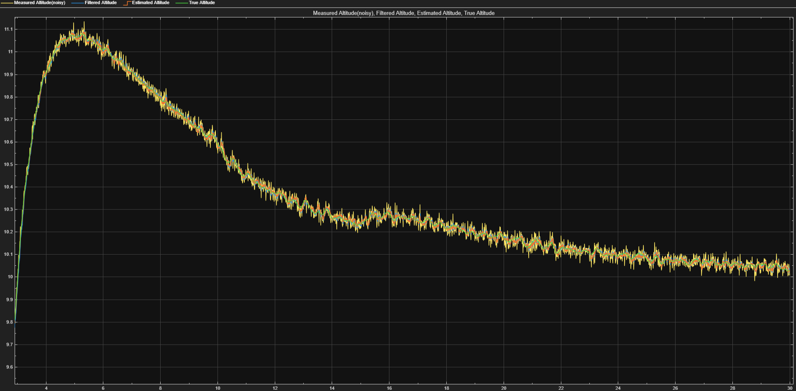

# Testing and Results

## Test configuration

The Simulink model was evaluated over a 30-second simulation.

| Test condition | Configuration |
|---|---|
| Commanded altitude | 10 m |
| Command step | 1 s |
| Thrust limits | 0–30 N |
| Sensor noise | 0.02 m standard deviation |
| Sensor sample rate | 100 Hz |
| Wind disturbance | −3 N from 10–15 s |

## Altitude tracking

The UAV tracks the 10 m command, initially overshooting to approximately 11.1 m before gradually settling toward the target. Estimated altitude closely follows true altitude in the recorded simulation.

## Sensor filtering and state estimation

The noisy altitude measurement fluctuates around true altitude. The low-pass filter and Kalman estimator provide smoother altitude signals, and the Kalman estimator also estimates vertical velocity.

## Wind disturbance rejection

A −3 N vertical disturbance is applied from 10 to 15 seconds. The controller raises thrust to compensate and returns toward nominal hover thrust after the disturbance ends. Altitude remains close to the target, though transient deviations occur.

## Observations

- The model maintains stable altitude tracking under the tested conditions.
- Thrust is constrained to the modeled 0–30 N actuator range.
- Filtered derivative action reduces noise-induced thrust fluctuations.
- Estimated altitude and velocity broadly follow the true simulated states.
- The thrust response compensates for the applied downward disturbance.

These results demonstrate feedback control, actuator saturation, disturbance rejection, sensor filtering, and state estimation in a simplified one-dimensional UAV model.
